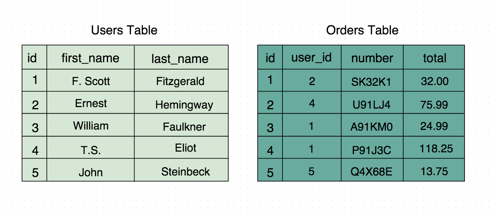
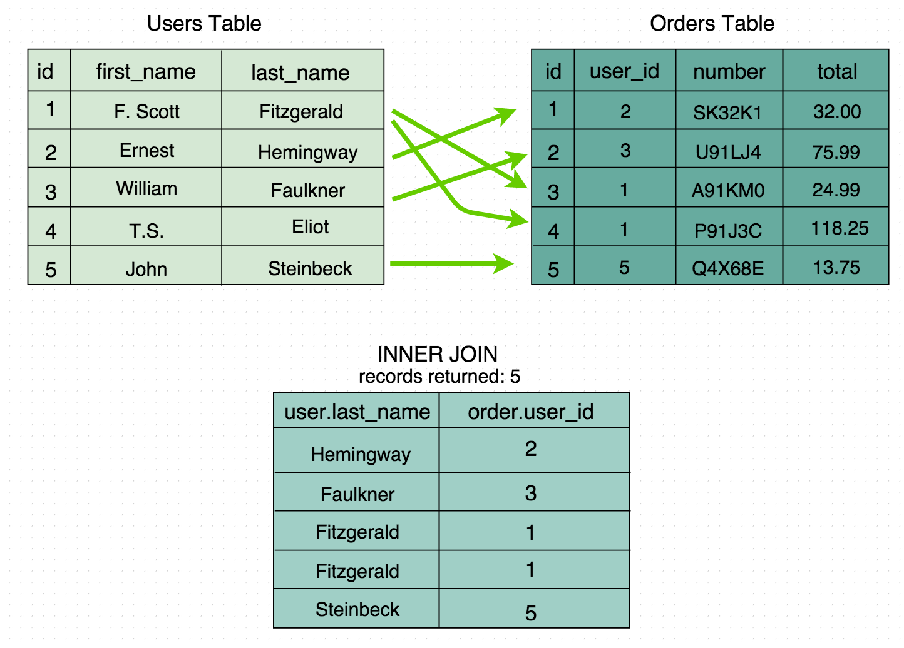
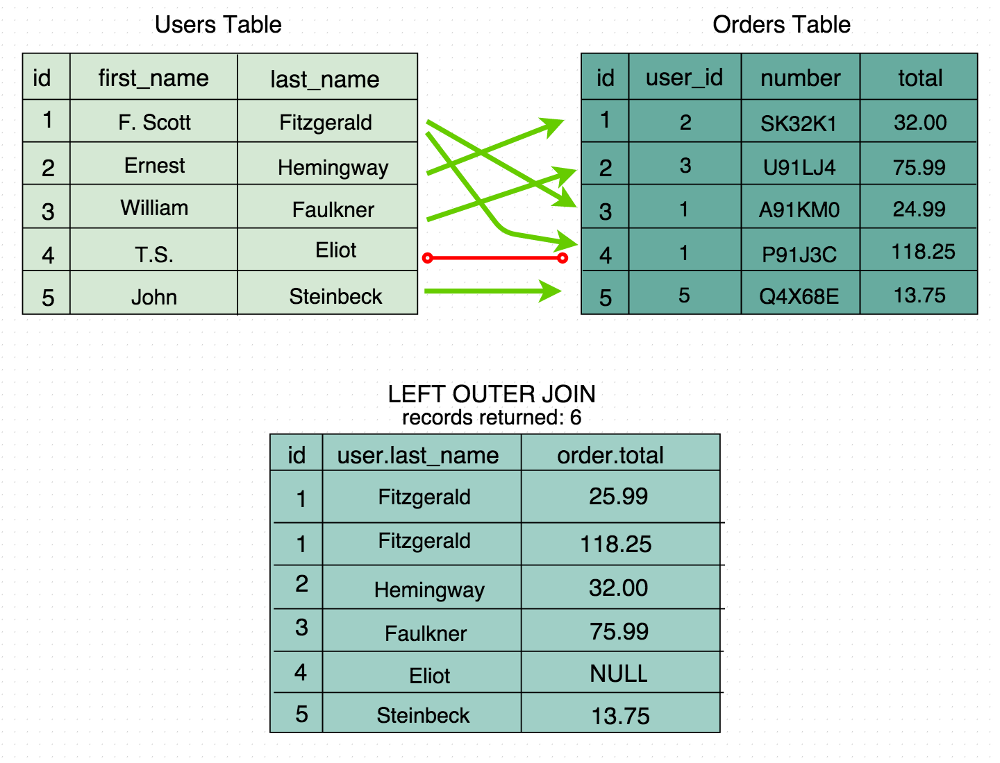
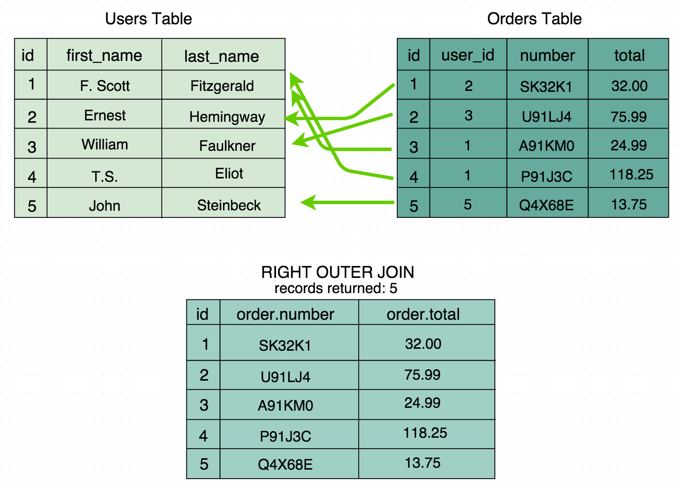

# Understanding SQL Joins

## Looking at Our Data
Before learning how to join tables, let’s see what data we’re working with.  
We have two tables in our **bookstore database**:



- **users** – stores each user’s first and last name  
- **orders** – stores order details, including which user made the order  

Each order is linked to a user using a **foreign key** (`user_id`), which matches the `id` column in the **users** table.

**Example:**
- A user can have many orders.  
- Each order belongs to one user.

---

## 🧩 What Are Joins?
**Joins** let us combine data from two or more tables based on related columns (usually a foreign key).  
This helps us see connected information — like which user made which order.

---

## 🔹 Inner Join
An **inner join** returns only the data that **exists in both tables**.

**Example:**  
Show only users who have placed at least one order.



```sql
SELECT users.last_name, orders.user_id
FROM users
INNER JOIN orders
ON users.id = orders.user_id
ORDER BY orders.id;
```

✅ **This returns:**  
- Only users who have orders.  
- If a user hasn’t placed any orders, they won’t appear in the results.  
- So if one user has no orders yet (like *“T.S. Eliot”*), they’ll be missing from the result.

---

## 🔸 Left Outer Join

A **left outer join** returns all the data from the **left table** (`users`),  
and any matching data from the **right table** (`orders`).

### Example

Show all users, and their order totals if they have any:



```sql
SELECT users.last_name, orders.total
FROM users
LEFT OUTER JOIN orders
ON users.id = orders.user_id
ORDER BY users.id;
```

✅ **This returns:**

- Every user (even if they haven’t placed an order).  
- If a user has no order, their order info will be `NULL`.  
- So *“T.S. Eliot”* will appear, but with `NULL` for the order total since he hasn’t ordered anything yet.

---

## 🔸 Right Outer Join

A **right outer join** is the opposite.  
It returns all the data from the **right table** (`orders`), and matching data from the **left table** (`users`).

### Example

Show all orders, even if they don’t belong to any user:



```sql
SELECT orders.number, orders.total
FROM users
RIGHT OUTER JOIN orders
ON users.id = orders.user_id
ORDER BY orders.id;
```

✅ **This returns:**

- Every order, even if the user who made it no longer exists.  
- If an order has no matching user, that user info will be `NULL`.

---

## 🧠 Summary (TL;DR)

| **Join Type**       | **What It Shows**                         | **Missing Matches Become** |
|----------------------|-------------------------------------------|-----------------------------|
| `INNER JOIN`         | Only rows that match in both tables       | Skipped                     |
| `LEFT OUTER JOIN`    | All from left table + matches from right  | NULL                        |
| `RIGHT OUTER JOIN`   | All from right table + matches from left  | NULL                        |

---

### In short:

- Use **`INNER JOIN`** when you only want matching records.  
- Use **`LEFT JOIN`** when you want everything from the first table, even if no match.  
- Use **`RIGHT JOIN`** when you want everything from the second table, even if no match.
